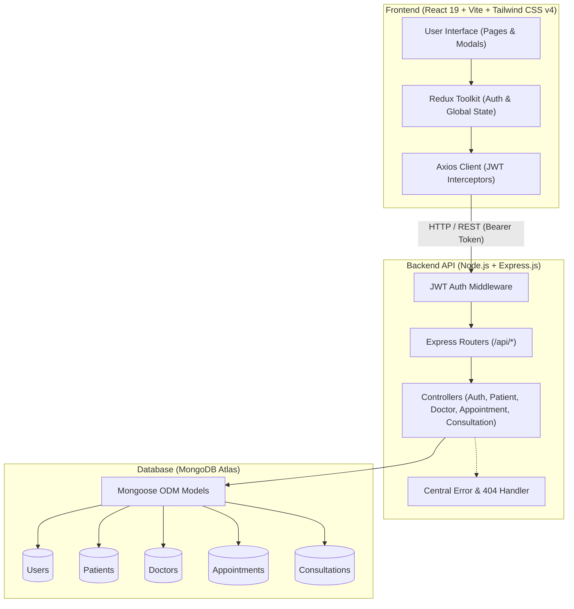

# 🏥 ClinicFlow — Modern OPD Management System

[](https://clinic-flow-tawny.vercel.app/)
[](https://nodejs.org/)
[](https://react.dev/)
[](https://tailwindcss.com/)
[](https://www.mongodb.com/)

> **ClinicFlow** is a streamlined, full-stack Outpatient Department (OPD) management web application designed for clinics, medical practitioners, and reception staff to efficiently handle patient registrations, doctor appointments, vital recordings, and consultation histories.

🌐 **Live Application:** [https://clinic-flow-tawny.vercel.app/](https://clinic-flow-tawny.vercel.app/)

---

## 📖 Table of Contents

- [About The Project](#-about-the-project)
- [Why You Should Use ClinicFlow](#-why-you-should-use-clinicflow)
- [System Architecture](#-system-architecture)
- [High-Level Folder Structure](#-high-level-folder-structure)
- [Key Features](#-key-features)
- [Technology Stack](#-technology-stack)
- [Getting Started Locally](#-getting-started-locally)
  - [Prerequisites](#prerequisites)
  - [Backend Setup](#1-backend-setup)
  - [Frontend Setup](#2-frontend-setup)
- [API Reference](#-api-reference)
- [License](#-license)

---

## 🩺 About The Project

Traditional clinic administration frequently suffers from fragmented paperwork, uncoordinated appointment queues, and slow patient lookups. **ClinicFlow** solves this with an end-to-end, real-time workflow:

1. **Staff Authentication:** Fast, passwordless demo authentication using Staff Name & Phone Number.
2. **Patient Management:** Fast demographic registration with instant case-insensitive search by name or 10-digit phone.
3. **Appointment Scheduling:** Seamless booking linking patients to specialized doctors, with dedicated views for today's active queues.
4. **Consultation & Vitals:** Capturing clinical vitals (Temperature, Pulse) and clinical notes, automatically transitioning appointment states upon completion.
5. **Medical History:** Immediate access to historical consultations categorized by patient.

---

## 💡 Why You Should Use ClinicFlow

- ⚡ **Zero-Friction Workflow:** Eliminates manual record-keeping with an interconnected data pipeline (`Patient` ➔ `Appointment` ➔ `Consultation`).
- 🎯 **Reliable & Consistent Data:** Unified standard response envelopes across all endpoints and centralized schema validation prevent broken states.
- 📱 **Modern & Responsive UI:** Built with React 19, Tailwind CSS v4, and Lucide icons for an intuitive, glassmorphic experience on desktops, tablets, and mobile devices.
- 🔍 **Instant Search & Filtering:** Debounced regex-safe patient searches and status-driven appointment queues.
- 🛡️ **JWT-Secured APIs:** Protects clinical endpoints with token-based authorization and interceptor-driven auto-redirection.

---

## 🏗️ System Architecture



---

## 📂 High-Level Folder Structure

```
ClinicFlow/
├── README.md                      # Project documentation
│
├── Backend/                       # Node.js & Express REST API
│   ├── .env.example               # Backend environment variable template
│   ├── package.json               # Backend dependencies & scripts
│   └── src/
│       ├── config/
│       │   └── db.js              # MongoDB Mongoose connection
│       ├── models/                # Schemas (User, Patient, Doctor, Appointment, Consultation)
│       ├── controllers/           # Business logic per resource
│       ├── routes/                # Express API routes mounted under /api
│       ├── middleware/            # JWT authentication & central error handlers
│       ├── utils/                 # Standard response helper & date utilities
│       ├── seed.js                # Database doctor seeding script
│       ├── app.js                 # Express app configuration & middleware
│       └── server.js              # Server entry point
│
└── Frontend/                      # React 19 + Vite Single Page Application
    ├── .env.example               # Frontend environment variable template
    ├── package.json               # Frontend dependencies & scripts
    ├── vite.config.js             # Vite bundler configuration
    ├── index.html                 # HTML template
    └── src/
        ├── api/                   # Axios client & centralized API service methods
        ├── components/            # Reusable UI components (Navbar, Modal, StatsCard, etc.)
        ├── context/ or store/     # Redux Toolkit slices (Auth, Patients, Appointments)
        ├── pages/                 # Main views (Dashboard, Patients, Appointments, Consultations)
        └── index.css              # Tailwind CSS styles
```

---

## ✨ Key Features

- **Staff Authentication:** Simple sign-in with staff name and 10-digit mobile number; issues secure JWT.
- **Patient Directory:** Complete registration form with validation, preventing duplicate phone numbers.
- **Doctor Catalog:** Pre-seeded specialty doctors (Cardiology, Pediatrics, Orthopedics, Dermatology, etc.) with dropdown integrations.
- **Smart Appointment Queue:** Schedule appointments with live patient/doctor validation; filter by `Today` or by status (`Scheduled` / `Completed`).
- **Clinical Consultations:** Record vital signs (°C Temperature, Pulse) and clinical notes. Marking consultation complete automatically updates the linked appointment.
- **Consultation History:** View all past visits and medical notes per patient.

---

## 🛠️ Technology Stack

| Layer | Technology |
|---|---|
| **Frontend** | React 19, Vite, Tailwind CSS v4, Redux Toolkit, React Router DOM, Axios, Lucide React, React Hot Toast, Framer Motion |
| **Backend** | Node.js, Express.js, Mongoose, JSONWebToken (JWT), CORS, Dotenv |
| **Database** | MongoDB Atlas |
| **Hosting** | Vercel (Frontend), Render (Backend) |

---

## 🚀 Getting Started Locally

### Prerequisites
- [Node.js](https://nodejs.org/) (v18 or higher)
- [MongoDB](https://www.mongodb.com/) (Local instance or MongoDB Atlas connection string)
- Git

---

### 1. Backend Setup

1. Open a terminal and navigate to the backend folder:
   ```bash
   cd Backend
   ```

2. Install dependencies:
   ```bash
   npm install
   ```

3. Create a `.env` file based on `.env.example`:
   ```env
   PORT=5000
   MONGO_URI=mongodb://127.0.0.1:27017/opd_mini
   JWT_SECRET=your_super_secret_jwt_key
   JWT_EXPIRES_IN=7d
   CORS_ORIGIN=http://localhost:5173
   ```

4. Seed initial doctors into MongoDB:
   ```bash
   npm run seed
   ```

5. Start the backend development server:
   ```bash
   npm run dev
   ```
   *The server will run on `http://localhost:5000`.*

---

### 2. Frontend Setup

1. In a new terminal window, navigate to the frontend folder:
   ```bash
   cd Frontend
   ```

2. Install dependencies:
   ```bash
   npm install
   ```

3. Create a `.env` file:
   ```env
   VITE_API_URL=http://localhost:5000/api
   ```

4. Start the frontend development server:
   ```bash
   npm run dev
   ```
   *The application will open at `http://localhost:5173`.*

---

## 📡 API Reference

| Method | Endpoint | Access | Description |
|---|---|---|---|
| `POST` | `/api/auth/register` | Public | Register staff user |
| `POST` | `/api/auth/login` | Public | Login with Name + Phone |
| `GET` | `/api/auth/me` | Private | Fetch logged-in user profile |
| `GET` | `/api/doctors` | Private | Fetch list of doctors |
| `POST` | `/api/doctors` | Private | Create a doctor record |
| `POST` | `/api/patients` | Private | Register new patient |
| `GET` | `/api/patients?search=` | Private | Search & list patients |
| `GET` | `/api/patients/:id` | Private | Get patient by ID |
| `POST` | `/api/appointments` | Private | Book an appointment |
| `GET` | `/api/appointments/today` | Private | Fetch today's appointment queue |
| `GET` | `/api/appointments?status=` | Private | Filter appointments by status |
| `POST` | `/api/consultations` | Private | Save consultation vitals & notes |
| `PATCH` | `/api/consultations/:id/complete` | Private | Mark consultation complete |
| `GET` | `/api/patients/:patientId/consultations` | Private | Get patient's completed consultation history |

---

## 📄 License

This project is open-source and available under the [ISC License](LICENSE).
